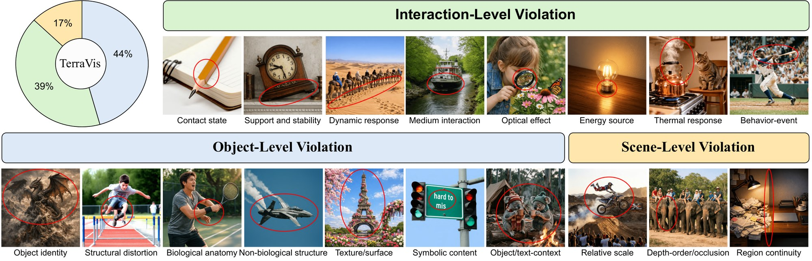

<div align="center">

<h2> TerraVis: Towards Evaluation of World-Grounded Visual Consistency in Text-to-Image Generation via MLLM Workflows</h2>

**Shuai&nbsp;Fu**<sup>1</sup> · **Jing&nbsp;Gu**<sup>2</sup> · **Jian&nbsp;Zhou**<sup>1</sup> · **Zicheng&nbsp;Duan**<sup>1</sup> · **Gengze&nbsp;Zhou**<sup>1</sup> · **Qi&nbsp;Wu**<sup>1,3*</sup>

<sup>1</sup>AIML,&nbsp;Adelaide&nbsp;University&emsp;<sup>2</sup>xAI&emsp;<sup>3</sup>Responsible&nbsp;AI&nbsp;Research&nbsp;Centre<br>
<sup>*</sup>Corresponding author

**NeurIPS 2026 (Evaluations and Datasets Track)**

[](https://arxiv.org/abs/2610.02959)
[](https://huggingface.co/datasets/ShyFoo/TerraVis-Annotations)
[](https://shyfoo.github.io/TerraVis-web/)
[](pyproject.toml)
[](LICENSE)

[🔍&nbsp;How&nbsp;It&nbsp;Works](#how-terravis-scores-an-image) •
[📊&nbsp;Supported&nbsp;Metrics](#supported-metrics) •
[⚙️&nbsp;Installation](#installation) •
[🚀&nbsp;Quick&nbsp;Start](#quick-start)<br>
[🖼️&nbsp;Evaluate&nbsp;Your&nbsp;Images](#evaluate-your-images) •
[🧪&nbsp;Benchmark&nbsp;Your&nbsp;Models](#benchmark-your-models) •
[🧩&nbsp;Extensibility](#adding-a-metric) •
[📝&nbsp;Citation](#citation)

</div>

<p align="center">
  
</p>

<p align="center"><sub><b>What TerraVis detects:</b> 18 types of world-consistency violations at three levels: object, interaction and scene. Each example image shows one type, with a red ellipse marking where the violation is visible.</sub></p>

**TerraVis** evaluates whether a generated image could exist in the real world. An MLLM judge probes the image for the 18 violation types above and turns what it finds into one world-consistency score.

This repository is the official implementation: TerraVis and 13 common T2I metrics behind one interface, to [score images you already have](#evaluate-your-images) or [benchmark your models against baselines](#benchmark-your-models) on nine bundled benchmarks or your own prompts. To try TerraVis without installing anything, upload an image to the [online evaluator](https://shyfoo.github.io/TerraVis-web/).

## News

- **[2026/10]** 🤗 We released the [TerraVis human annotations](https://huggingface.co/datasets/ShyFoo/TerraVis-Annotations) on Hugging Face, comprising 13,500 world-consistency ratings for 4,500 generated images. 
- **[2026/10]** 📄 The TerraVis paper is now available on [arXiv](https://arxiv.org/abs/2610.02959).
- **[2026/09]** 🌐 The [online evaluator](https://shyfoo.github.io/TerraVis-web/) is live: upload a generated image to get its TerraVis score, along with detected violations, supporting evidence, and severity.
- **[2026/09]** 🎉 TerraVis has been accepted to NeurIPS 2026 (Evaluations and Datasets Track).

## How TerraVis Scores an Image

- **Input:** the image alone, without its text prompt.
- **Judge:** a VLM (open-weight or API) answers steps 1 to 3, one question per query.
- **Score:** step 4 is a fixed formula.

<picture>
  <source media="(prefers-color-scheme: dark)" srcset="assets/terravis-workflow-dark.svg">
  
</picture>

The 18 violation types probed in step 2:

| Level           | Violation types                                                                                                                             |
|-----------------|---------------------------------------------------------------------------------------------------------------------------------------------|
| Object (7)      | Object identity, Structural distortion, Biological anatomy, Non-biological structure, Texture/surface, Symbolic content, Object-context     |
| Interaction (8) | Contact state, Support and stability, Dynamic response, Medium interaction, Optical effect, Energy source, Thermal response, Behavior-event |
| Scene (3)       | Relative scale, Depth-order/occlusion, Region continuity                                                                                    |

- **Scored `"n/a"`:** an ineligible image, one the judge left unanswered (a failed or blocked request), or one whose eligibility answer could not be parsed.
- **Result JSON:** keeps every probe's raw answer, affected aspect, evidence and severity, so each score, n/a included, traces back to what the judge saw.
- **Prompts:** [`terravis_prompts.py`](src/terravis/scores/metrics/terravis_prompts.py).

## Dataset

On COCO-T2I and GenAI-Bench, with over 13K human annotations collected via Amazon Mechanical Turk for images generated by five T2I models, TerraVis agrees with human judgments of world consistency better than existing quality, alignment and preference metrics. The annotations and the rated images are on Hugging Face as [🤗&nbsp;ShyFoo/TerraVis-Annotations](https://huggingface.co/datasets/ShyFoo/TerraVis-Annotations).

| Benchmark   | Prompts | Images | Human ratings |
|-------------|---------|--------|---------------|
| COCO-T2I    | 100     | 500    | 1,500         |
| GenAI-Bench | 800     | 4,000  | 12,000        |
| **Total**   | 900     | 4,500  | 13,500        |

- **Prompts:** a random half of each benchmark (COCO-T2I has 200 prompts, GenAI-Bench 1,600).
- **Images:** one 1024×1024 image per prompt from each of GPT Image 1.5, Nano Banana Pro, FLUX.2 [dev], Qwen-Image-2512 and Stable Diffusion 3.5 Large.
- **Ratings:** three world-consistency ratings per image, collected on Amazon Mechanical Turk. Each is 1 (completely inconsistent) to 5 (fully consistent), or N/A for images out of scope such as abstract patterns, logos or charts. Annotators see the image but not its prompt.

```python
# pip install "datasets>=4.0"; the full download is about 7 GB
from datasets import load_dataset

ds = load_dataset("ShyFoo/TerraVis-Annotations")  # splits: coco_t2i, genai_bench
```

## Supported Metrics

| Metric                     | `score_mode`             | Category                      | Input                      | Scoring model                             | Score Range |
|----------------------------|--------------------------|-------------------------------|----------------------------|-------------------------------------------|-------------|
| **TerraVis**               | `terravis_score`         | World Consistency             | Image                      | Any VLM judge (open-weight or API)        | (0, 1]      |
| **MUSIQ**&nbsp;†           | `musiq_score`            | Technical Quality             | Image                      | Dedicated: MUSIQ (KonIQ-10k)              | [0, 100]    |
| **Aesthetic Score**&nbsp;† | `laion_aesthetic_score`  | Aesthetics                    | Image                      | Dedicated: Aesthetic Predictor V2.5       | [1, 10]     |
| **CLIPScore**              | `clip_score`             | Text–Image Alignment          | Image + Text               | Any OpenCLIP model                        | [0, 1]      |
| **TIFA**                   | `tifa_score`             | Text–Image Alignment          | Image + Text               | Any open-weight VLM judge                 | [0, 1]      |
| **DSG**                    | `dsg_score`              | Text–Image Alignment          | Image + Text               | Any open-weight VLM judge                 | [0, 1]      |
| **VQAScore**               | `vqa_score`              | Text–Image Alignment          | Image + Text               | Any open-weight VLM judge                 | [0, 1]      |
| **RAHF**&nbsp;†            | `rahf_score`             | Human Feedback                | Image + Text               | Dedicated: RAHF multi-head                | [0, 1]      |
| **ImageReward**            | `image_reward_score`     | Human Preference              | Image + Text               | Dedicated: ImageReward v1.0               | ≈ [−2, 2]   |
| **PickScore**              | `pick_score`             | Human Preference              | Image + Text               | Dedicated: PickScore v1                   | ≈ [20, 30]  |
| **HPSv3**                  | `hpsv3_score`            | Human Preference              | Image + Text               | Dedicated: HPSv3 (Qwen2-VL-7B)            | ≈ [0, 15]   |
| **UnifiedReward 2.0**      | `unified_reward_2_score` | Human Preference              | Image + Text               | Dedicated: UnifiedReward-2.0 (Qwen3.5-9B) | [1, 5]      |
| **GenEval 2**&nbsp;†       | `geneval2_score`         | Benchmark-Specific Evaluation | Benchmark metadata + Image | Dedicated: Qwen3-VL-8B-Instruct           | [0, 1]      |
| **UniGenBench++**          | `unigenbench_score`      | Benchmark-Specific Evaluation | Benchmark metadata + Image | Any open-weight VLM judge                 | [0, 1]      |

† Comes with terms stricter than MIT: noncommercial use only, or an AGPL-3.0 dependency. Details in [THIRD_PARTY_NOTICES](THIRD_PARTY_NOTICES).

- **Image-level metrics** (the first twelve): score any image; `Image` metrics read the image alone, `Image + Text` metrics also its prompt.
- **[Benchmark-specific evaluation](#benchmark-specific-evaluation)** (the last two): runs a benchmark's own protocol on metadata stored with its prompts, so it scores only images generated from that benchmark (`geneval2`, `unigenbench++`); any other prompt raises.
- **`Any … judge`:** the judge comes from `vqa_model_names` / `api_model_name` and runs in one of four [judge options](#metrics-with-a-judge): transformers (default), in-process vLLM, a vLLM server or an API judge (`terravis_score` only).
- **`Dedicated`:** the model downloads into `model_weight_root` and takes no model argument.

## Installation

### Set Up the Environment

```bash
conda env create -f environment.yaml
conda activate terravis
pip install torch==2.11.0 torchvision==0.26.0 torchaudio==2.11.0 \
    --index-url https://download.pytorch.org/whl/cu130
pip install -e .

# Optional
pip install -e ".[flash-attn]" --no-build-isolation  # FlashAttention; sdpa without it
pip install -e ".[vllm]" --no-build-isolation        # vLLM judge (Step 2 options 2 and 3)
pip install -e ".[aesthetic]"                        # laion_aesthetic_score (AGPL-3.0 package)
```

### Set Root Paths

Edit the two paths in [`scripts/set_root_paths.sh`](scripts/set_root_paths.sh); every script and CLI reads them from there:

```bash
export MODEL_WEIGHT_ROOT="${MODEL_WEIGHT_ROOT:-/data/model_weights}"      # all model weights
export SAVE_ROOT="${SAVE_ROOT:-/data/TerraVis-results/gen_images}"        # Step 1 output, Step 2 input
```

- **Overrides:** an exported `MODEL_WEIGHT_ROOT` / `SAVE_ROOT` wins over the file.
- **Layout:** Hugging Face repos (judges, T2I models, CLIP) go to `$MODEL_WEIGHT_ROOT/hf_cache`, each metric's own weights to a folder of its own.

### API Keys and HF Token

Only for the models listed; open-weight judges such as `google/gemma-4-31B-it` need none.

```bash
export OPENAI_API_KEY=sk-...   # judges gpt-5.5, gpt-5.6-sol; T2I gpt-image-1.5, gpt-image-2
export GOOGLE_API_KEY=...      # or GEMINI_API_KEY; judge gemini-3.8-flash;
                               #   T2I gemini-3-pro-image, gemini-3.1-flash-image (Nano Banana Pro / 2)
export IDEOGRAM_API_KEY=...    # T2I ideogram-ai/ideogram-4-fp8 only; free at developer.ideogram.ai
```

Gated Hugging Face repos need their license accepted and a token:

```bash
# 1. Accept the license on each gated repo you use, e.g. https://huggingface.co/black-forest-labs/FLUX.2-dev
# 2. Log in with a Read token from https://huggingface.co/settings/tokens
hf auth login                  # or: export HF_TOKEN=hf_...
```

- **Gated:** `stabilityai/stable-diffusion-3.5-large`, `stabilityai/stable-diffusion-3.5-large-turbo`, `black-forest-labs/FLUX.2-dev`, `black-forest-labs/FLUX.2-klein-9B`, `ideogram-ai/ideogram-4-fp8`.
- **Not gated:** `google/gemma-4-31B-it`, `Qwen/Qwen3.8-27B`, Qwen-Image, Cosmos3, HiDream and every metric's own weights.

### Prepare Model Weights (Optional)

Models download on first use. For offline or cluster nodes, pre-stage them from a machine with internet:

```bash
python scripts/prepare_model_weights.py                                         # every metric's own weights
python scripts/prepare_model_weights.py --only rahf pickscore                   # only these (keys from --list)
python scripts/prepare_model_weights.py --judge google/gemma-4-31B-it           # a judge
python scripts/prepare_model_weights.py --t2i black-forest-labs/FLUX.2-klein-9B # a T2I model
python scripts/prepare_model_weights.py --clip webli:ViT-gopt-16-SigLIP2-384    # clip_score's OpenCLIP model

python scripts/prepare_model_weights.py --list                                  # what it would stage
python scripts/prepare_model_weights.py --verify-only                           # what is already there
```

Then on the offline node, with the same `MODEL_WEIGHT_ROOT`:

```bash
export HF_HUB_OFFLINE=1
```

## Quick Start

Score one image from Python:

```python
from terravis.scores.evaluator import T2IScoreEvaluator

# Image metric: the image alone
terravis_scorer = T2IScoreEvaluator(
    score_mode="terravis_score",
    device="cuda:0",  # "balanced" for multi-GPU inference
    model_weight_root="./model_weights",
    dtype="bf16",
    vqa_model_names="google/gemma-4-31B-it",
    sampling_params={"max_new_tokens": 256},  # the CLI takes this from models.yaml; from Python it must be given
)
print(terravis_scorer(image="path/to/image.png"))  # {"terravis_score": {"score": ..., ...}}

# Image + Text metric: the image and its prompt
clip_scorer = T2IScoreEvaluator(
    score_mode="clip_score",
    device="cuda:0",
    model_weight_root="./model_weights",
    dtype="bf16",
    clip_model_name="webli:ViT-gopt-16-SigLIP2-384",
)
print(clip_scorer(image="path/to/image.png", text="a cat sitting on a mat"))
```

## Evaluate Your Images

Score images you already have, from any model or source; nothing is generated.

### Image Metrics: Just the Folder

`terravis_score`, `musiq_score` and `laion_aesthetic_score` need only `--image_dir`:

```bash
# Score each folder (here, one per model) with an image metric
for folder in /path/to/model_a_images /path/to/model_b_images; do
  terravis-score --score_mode terravis_score --image_dir "$folder" --save_path /path/to/output \
    --vqa_model_names google/gemma-4-31B-it   # or an API judge: --api_model_name gpt-5.5 (needs OPENAI_API_KEY)
done

# Compare: each metric's mean, one column per folder
terravis-summarize /path/to/output
```

- **Scored:** every `.png`, `.jpg`, `.jpeg` and `.webp` file directly in the folder.
- **Folder names:** a folder's last path part names its results and its summary column, so `exp1/images` and `exp2/images` would overwrite each other; give each folder its own name.
- **`musiq_score`, `laion_aesthetic_score`:** use their own weights, so drop `--vqa_model_names`; `laion_aesthetic_score` needs the `aesthetic` extra.
- **Judge options:** transformers on every visible GPU by default; `--vllm_tp_size N` runs in-process vLLM on N GPUs (needs the `vllm` extra), or use a vLLM server; see the [judge options](#metrics-with-a-judge).

### Prompt-Image Metrics: Add a Prompts File

The `Image + Text` metrics also need each image's prompt, passed with `--prompts_json`, one entry per image:

```json
[
  {"image_id": "cat.png", "prompt": "a cat sitting on a mat"},
  {"image_id": "dog.jpg", "prompt": "a dog running on the beach"}
]
```

```bash
# Score the listed images in each folder with a prompt-image metric
# clip_score adds --clip_model_name webli:ViT-gopt-16-SigLIP2-384;
# tifa_score, dsg_score and vqa_score add --vqa_model_names google/gemma-4-31B-it
for folder in /path/to/model_a_images /path/to/model_b_images; do
  terravis-score --score_mode pick_score --image_dir "$folder" --prompts_json /path/to/prompts.json \
    --save_path /path/to/output
done

# Compare: each metric's mean, one column per folder
terravis-summarize /path/to/output
```

- **`image_id`:** the file's path inside `--image_dir`, with extension (`run1/cat.png` works too).
- **Scored:** only the listed images; a listed image missing from the folder stops the run before any model loads.
- **Several folders:** one prompts file serves them all when they name their images alike; the folders themselves need distinct names.
- **Other fields:** copied to the image's result.

### Results

Each run writes one file to `<save_path>/<folder name>/raw/` and prints its mean score. To continue an interrupted run:

```bash
terravis-score <same flags> --resume   # also retries images whose judge requests failed
```

- **Example file:** `/path/to/output/model_a_images/raw/t2i_scoring__raw__model_a_images__pick_score__judge=pickscore-v1.json`.
- **Entries:** one per image, with its score added, e.g. `"pick_score": {"score": 19.375, ...}`.

## Benchmark Your Models

Run your model and its baselines through both steps on the same prompts; their scores compare directly.

- **Step 1:** [generate](#step-1-generate-images) one PNG per prompt, plus a `test_data.json` manifest.
- **Step 2:** [score](#step-2-compute-t2i-scores) each manifest with any image-level metric, plus the benchmark's [own metric](#benchmark-specific-evaluation) if it has one.
- **Prompts:** a [popular benchmark](#on-popular-benchmarks) or [your own](#on-your-own-prompts).
- **Models:** a [registry](src/terravis/configs/models.yaml) baseline (FLUX.2, Qwen-Image, GPT Image, Nano Banana, …), any diffusers pipeline on the Hub, or [your own model](#your-own-models).
- **Images already made:** [evaluate them directly](#evaluate-your-images).

### On Popular Benchmarks

#### Image-Level Evaluation

Render a benchmark's prompts with each model, then score every run with an image-level metric (`geneval2` and `unigenbench++` included):

| `<benchmark>`   | Prompts |
|-----------------|---------|
| `coco_t2i`      | 200     |
| `geneval`       | 553     |
| `dpg_bench`     | 1,065   |
| `genai_bench`   | 1,600   |
| `partiprompts`  | 1,632   |
| `tiif_bench`    | 4,976   |
| `t2i_compbench` | 6,000   |

```bash
# Step 1: generate              <benchmark>  <model_name>          <num_gpus>
bash scripts/t2i_generation.sh  genai_bench  /path/to/my_model     1   # your model
bash scripts/t2i_generation.sh  genai_bench  Qwen/Qwen-Image-2512  1   # open-weight baseline
bash scripts/t2i_generation.sh  genai_bench  gpt-image-1.5         0   # API baseline, no GPU; needs OPENAI_API_KEY

# Step 2: score each run, by short name (lowercased last part of model_name), with an image-level metric
for model in my_model qwen-image-2512 gpt-image-1.5; do
  bash scripts/compute_t2i_scores.sh terravis_score "genai_bench/$model/seed=1111/test_data.json" \
    /path/to/output "" google/gemma-4-31B-it ""
done

# Compare: a table per benchmark, each metric's mean per model
terravis-summarize /path/to/output
```

- **Results:** one file per model in `/path/to/output/GenAI-Bench/raw/`, the benchmark spelled as in its metadata.
- **Other metrics and judges:** change `terravis_score` and the last three arguments (CLIP model, open-weight judge, API judge), e.g. `pick_score … "" "" ""`, or an API judge for `terravis_score`, `… "" "" gpt-5.5` (needs `OPENAI_API_KEY`); [Step 2](#step-2-compute-t2i-scores) lists each metric's arguments and the [judge options](#metrics-with-a-judge).

#### Benchmark-Specific Evaluation

`geneval2` and `unigenbench++` also have their own evaluation protocols, each run as its own `score_mode`:

| `<benchmark>`   | Prompts                     | `score_mode`        |
|-----------------|-----------------------------|---------------------|
| `geneval2`      | 800                         | `geneval2_score`    |
| `unigenbench++` | 1,200 (600 short, 600 long) | `unigenbench_score` |

```bash
# Step 1: generate              <benchmark>    <model_name>          <num_gpus>
bash scripts/t2i_generation.sh  geneval2       /path/to/my_model     1   # your model
bash scripts/t2i_generation.sh  geneval2       Qwen/Qwen-Image-2512  1   # baseline
bash scripts/t2i_generation.sh  unigenbench++  /path/to/my_model     1   # your model
bash scripts/t2i_generation.sh  unigenbench++  Qwen/Qwen-Image-2512  1   # baseline

# Step 2: score each run, by short name (lowercased last part of model_name), with its benchmark's own metric
for model in my_model qwen-image-2512; do
  bash scripts/compute_t2i_scores.sh geneval2_score    "geneval2/$model/seed=1111/test_data.json" \
    /path/to/output "" "" ""                        # dedicated Qwen3-VL-8B-Instruct: no model argument
  bash scripts/compute_t2i_scores.sh unigenbench_score "unigenbench++/$model/seed=1111/test_data.json" \
    /path/to/output "" google/gemma-4-31B-it "" 2   # 2 = in-process vLLM on 2 GPUs (vllm extra); 0 = transformers
done

# Compare: a table per benchmark, each metric's mean per model, plus each protocol's official figures
terravis-summarize /path/to/output
```

- **GenEval 2:** 100 × the mean `geneval2_score` over all 800 prompts is the official number (Overall); the per-skill and per-atomicity figures follow upstream `soft_tifa_analysis.py`: a skill pools its questions across prompts (Soft-TIFA AM), so it differs from averaging per image. Noncommercial use only (CC BY-NC 4.0).
- **UniGenBench++ accuracies:** computed as on the official leaderboards. Short and long prompts are reported separately; each dimension pools its testpoints and Overall averages the 10 primary dimensions, so Overall differs from the mean score.
- **Leaderboard judge:** Gemini 2.5 Pro on 4 images per prompt, while this run uses your judge on one; compare these accuracies only across runs scored the same way.
- **Results:** `/path/to/output/GenEval2/raw/` and `/path/to/output/UniGenBench++/raw/`.
- **Other prompts:** both metrics stop with an error on any prompt that is not from their own benchmark.

### On Your Own Prompts

A JSON list of prompt strings, or a bundled DiffusionDB pool, takes the benchmark's place:

```bash
# Prompts: a JSON list of strings; the file's name (my_prompts) names the run
echo '["a cat sitting on a mat", "a dog running on the beach"]' > my_prompts.json

# Step 1: generate              <benchmark>      <model_name>          <num_gpus>
bash scripts/t2i_generation.sh  my_prompts.json  /path/to/my_model     1   # your model
bash scripts/t2i_generation.sh  my_prompts.json  Qwen/Qwen-Image-2512  1   # baseline

# Step 2: score each run, by short name (lowercased last part of model_name), with an image-level metric
for model in my_model qwen-image-2512; do
  bash scripts/compute_t2i_scores.sh terravis_score "my_prompts/$model/seed=1111/test_data.json" \
    /path/to/output "" google/gemma-4-31B-it ""
done

# Compare: each metric's mean per model
terravis-summarize /path/to/output
```

- **Run name:** the file's name, in Step 2's path and the results folder (`/path/to/output/my_prompts/raw/`); it must not clash with a bundled benchmark or pool.
- **Adding prompts:** append only, since a resumed run (`RESUME=1 bash scripts/t2i_generation.sh …`) matches prompts by list position.
- **DiffusionDB pools:** `diffusiondb_15k-train` (15,000 prompts) and `diffusiondb_1k-test` (1,000), sampled from [DiffusionDB](https://huggingface.co/datasets/poloclub/diffusiondb). Pass the name in place of `my_prompts.json` in Step 1 and of `my_prompts` in Step 2; results land in `DiffusionDB-Large-Train/raw/` or `DiffusionDB-Large-Test/raw/`.
- **Benchmark-specific evaluation:** does not apply.

### Your Own Models

A fine-tuned or retrained model plugs in as `<model_name>` in one of three ways, then runs like any baseline; ways 2 and 3 first need the `models.yaml` entries below, and the SD3.5-Large lines an [HF token](#api-keys-and-hf-token):

```bash
# Step 1: generate              <benchmark>  <model_name>                            <num_gpus>
bash scripts/t2i_generation.sh  genai_bench  /path/to/my_model                       1   # 1. a checkpoint
bash scripts/t2i_generation.sh  genai_bench  /path/to/sd3.5-large-dpo                1   # 2. a models.yaml entry
bash scripts/t2i_generation.sh  genai_bench  sd3.5-large-my-lora                     1   # 3. your own loader
bash scripts/t2i_generation.sh  genai_bench  stabilityai/stable-diffusion-3.5-large  1   # baseline

# Step 2: score each run, by short name (lowercased last part of model_name), with an image-level metric
for model in my_model sd3.5-large-dpo sd3.5-large-my-lora stable-diffusion-3.5-large; do
  bash scripts/compute_t2i_scores.sh terravis_score "genai_bench/$model/seed=1111/test_data.json" \
    /path/to/output "" google/gemma-4-31B-it ""
done

# Compare: a table per benchmark, each metric's mean per model
terravis-summarize /path/to/output
```

- **1. A diffusers checkpoint** (a `save_pretrained` directory): pass its path as `model_name`, with a `/` (`./my_model`).
  - It renders with its pipeline's default call arguments.
  - Its directory name, lowercased, becomes its short name in output paths (`./ckpt/My-FT-v2` → `my-ft-v2`): give each checkpoint its own.
- **2. The same, with its base model's settings:** copy the base model's entry under `t2i:` in [`models.yaml`](src/terravis/configs/models.yaml), set `id` to the checkpoint path, and pass that `id` exactly (or its short name) as `model_name`. This matters when the entry sets `inference_kwargs` (FLUX.2-klein-9B runs 4 steps).
- **3. Anything else** (a LoRA, a fine-tuned transformer alone, a new architecture): set `loader: path/to/file.py:function` (or `package.module:function`) and pass the entry's `id` as `model_name`. The function returns either
  - a diffusers pipeline, or
  - an object whose `generate_image(prompt=[...], seeds=[...], **kwargs)` returns one PIL image (or `None`) per prompt. It gets the entry's `height`, `width` and `inference_kwargs` as `kwargs`, and needs a `to(device)` under `data_parallel`.

```yaml
# src/terravis/configs/models.yaml, under t2i:
  - id: /path/to/sd3.5-large-dpo       # way 2: the stabilityai/stable-diffusion-3.5-large entry, new id
    parallel_mode: data_parallel
    num_workers: 2
    height: 1024
    width: 1024

  - id: sd3.5-large-my-lora            # way 3: a loader of your own
    loader: /path/to/my_loaders.py:load_lora
    num_workers: 2
    height: 1024
    width: 1024
```

```python
# my_loaders.py (way 3)
from dataclasses import replace

from terravis.models.text2image import load_diffusers

def load_lora(spec, weight_root, parallel_mode, dtype):
    base = replace(spec, id="stabilityai/stable-diffusion-3.5-large")   # loaded as the baseline is
    pipe = load_diffusers(base, weight_root, parallel_mode, dtype)
    pipe.load_lora_weights("/path/to/lora")
    return pipe
```

### Step 1: Generate Images

```bash
bash scripts/t2i_generation.sh <benchmark> <model_name> <num_gpus>
```

| Parameter    | Description                                                                                                                                                                                                  |
|--------------|--------------------------------------------------------------------------------------------------------------------------------------------------------------------------------------------------------------|
| `benchmark`  | A [popular benchmark](#on-popular-benchmarks), a [DiffusionDB prompt pool](#on-your-own-prompts), or [your prompts](#on-your-own-prompts) as a JSON list of strings                                           |
| `model_name` | HF repo id, API model name, registry short name (`gpt-image-1.5`, `ideogram-4-fp8-turbo`) or [local checkpoint](#your-own-models); per-model defaults come from the [model registry](#model-registry--naming) |
| `num_gpus`   | GPUs for parallel generation (`0` = CPU)                                                                                                                                                                     |

- **Output:** one PNG per prompt plus `test_data.json` in `$SAVE_ROOT/<benchmark>/<short name>/seed=1111/`; Step 2 takes the manifest as `<benchmark>/<short name>/seed=1111/test_data.json`.
- **Short name:** the lowercased last part of `model_name` (`Qwen/Qwen-Image-2512` → `qwen-image-2512`, `/path/to/my_model` → `my_model`).
- **Keys:** API and gated models need an [API key or HF token](#api-keys-and-hf-token).

**Resume** an interrupted run:

```bash
RESUME=1 bash scripts/t2i_generation.sh genai_bench /path/to/my_model 1   # skip prompts already rendered
```

- Your own prompts are matched by list position: only append to the file.
- A failed prompt leaves a `.txt` marker that also counts as rendered; delete it to retry.
- Step 2 scores a run only once every prompt has an image.

**Sweeps** over benchmarks × models: edit the top of [`scripts/submit_local_gen_jobs.sh`](scripts/submit_local_gen_jobs.sh), then run `bash scripts/submit_local_gen_jobs.sh`.

```bash
# top of scripts/submit_local_gen_jobs.sh
num_gpus=1                                                 # per-model VRAM and GPU counts: models.yaml
benchmarks=("coco_t2i" "/path/to/my_prompts.json")         # your own prompts mix in
model_names=("Qwen/Qwen-Image-2512" "/path/to/my_model")   # so do your own models
```

<details>
<summary>Multi-GPU replicas, Ideogram and registry overrides</summary>

**Multi-GPU replicas:** for a `model_sharding` model (`FLUX.2-dev`, `Cosmos3-Super-Text2Image-4Step`), `num_gpus` = k × `gpus_per_replica` runs k replicas over disjoint slices and merges their metadata:

```bash
# 8 GPUs / 2 per replica = 4 replicas, ~4x throughput
GPUS_PER_REPLICA=2 bash scripts/t2i_generation.sh coco_t2i black-forest-labs/FLUX.2-dev 8
```

- **`GPUS_PER_REPLICA`:** set it to fit your GPUs' memory; unset, it comes from [`models.yaml`](src/terravis/configs/models.yaml) (2 for both models, sized for 80 GB GPUs).
- **FLUX.2-dev:** diffusers places each component whole on one GPU, so its ~64 GB transformer and ~48 GB text encoder each need a GPU with that much room left (otherwise it moves to the CPU).

**Ideogram:** `ideogram-ai/ideogram-4-fp8` rewrites every prompt through Ideogram's hosted magic-prompt API before generation:

- It needs `IDEOGRAM_API_KEY` and internet, so an offline node cannot generate with it.
- `test_data.json` records the original prompt.
- The rewrite is unseeded: reruns are not bit-reproducible.

**Registry overrides:** call the CLI directly; flags left unset keep the registry defaults:

```bash
accelerate launch --num_processes 1 -m terravis.cli.generate \
  --model_name HiDream-ai/HiDream-O1-Image --benchmark coco_t2i --seed 1111 \
  --eval_batch_size 2
```

</details>

### Step 2: Compute T2I Scores

Score one Step 1 run with one metric:

```bash
bash scripts/compute_t2i_scores.sh \
  <score_mode> <gen_data_json_path> <save_path> \
  <clip_model_name> <vqa_model_names> <api_model_name> [vllm_tp_size]
```

| Parameter            | Description                                                                                                                                                        |
|----------------------|--------------------------------------------------------------------------------------------------------------------------------------------------------------------|
| `score_mode`         | Any mode from [Supported Metrics](#supported-metrics)                                                                                                              |
| `gen_data_json_path` | A run's `test_data.json` from Step 1, relative to `SAVE_ROOT` (`genai_bench/my_model/seed=1111/test_data.json`) or absolute; the run folder may be moved or copied |
| `save_path`          | Output root for the results                                                                                                                                        |
| `clip_model_name`    | `clip_score` only: an OpenCLIP model as `pretrained:arch`, e.g. `webli:ViT-gopt-16-SigLIP2-384`                                                                    |
| `vqa_model_names`    | Judge metrics, [options 1–3](#metrics-with-a-judge): one open-weight judge, as an HF repo id (e.g. `google/gemma-4-31B-it`) or its registered short name           |
| `api_model_name`     | `terravis_score` only, [option 4](#option-4-api-judge): an API judge instead (e.g. `gpt-5.5`, `gemini-3.8-flash`)                                                  |
| `vllm_tp_size`       | *(optional)* `0` (default) for [option 1](#option-1-transformers-default), `N ≥ 1` for [option 2](#option-2-in-process-vllm) (in-process vLLM on N GPUs)           |

Pass `""` for every model argument a mode does not use.

#### Metrics Without a Judge

`clip_score` and the metrics with dedicated weights take no judge, so the options below do not apply:

```bash
# Dedicated weights: no model argument
bash scripts/compute_t2i_scores.sh musiq_score /path/to/test_data.json /path/to/output "" "" ""

# clip_score: an OpenCLIP model
bash scripts/compute_t2i_scores.sh clip_score /path/to/test_data.json /path/to/output \
  webli:ViT-gopt-16-SigLIP2-384 "" ""
```

- **Dedicated weights:** `musiq_score`, `laion_aesthetic_score` (needs the `aesthetic` extra), `rahf_score`, `image_reward_score`, `pick_score`, `hpsv3_score`, `unified_reward_2_score` and `geneval2_score` (pinned Qwen3-VL-8B-Instruct; [`geneval2` runs only](#benchmark-specific-evaluation)).

#### Metrics With a Judge

`terravis_score`, `vqa_score`, `tifa_score`, `dsg_score` and `unigenbench_score` need a VLM judge. Pick how it runs:

| Option                                            | Pick it when                                                               | Needs                                   | Set it with                                                  |
|---------------------------------------------------|----------------------------------------------------------------------------|-----------------------------------------|--------------------------------------------------------------|
| [1. Transformers](#option-1-transformers-default) | Simplest: nothing to install or start                                      | GPUs here (it uses every visible one)   | `vllm_tp_size`: `0` (default)                                |
| [2. In-process vLLM](#option-2-in-process-vllm)   | Faster scoring, if you can install vLLM                                    | The `vllm` extra; N GPUs here           | `vllm_tp_size`: `N`                                          |
| [3. vLLM server](#option-3-vllm-server)           | Many runs ([a sweep](#sweeps)) share one judge, or it runs on another host | The `vllm` extra and GPUs on the server | `serve_vllm_judge.sh`, then `TERRAVIS_REMOTE_VLLM_ENDPOINTS` |
| [4. API judge](#option-4-api-judge)               | No GPU; `terravis_score` only                                              | An OpenAI or Google API key             | `api_model_name`                                             |

- **Open-weight judge** (options 1–3): one VLM in `vqa_model_names`. `tifa_score` and `dsg_score` also use it to write their questions, so it must be a dual-role model such as `google/gemma-4-31B-it`.
- **`terravis-score`** (folders): the same options as flags, `--vqa_model_names`, `--vllm_tp_size N`, `--api_model_name` and `--api_provider` (for `API_PROVIDER=`); `TERRAVIS_REMOTE_VLLM_ENDPOINTS` and `TERRAVIS_COMPILE_JUDGE` work unchanged.

#### Option 1: Transformers (Default)

The judge loads with transformers in the scoring process; omit `vllm_tp_size`:

```bash
bash scripts/compute_t2i_scores.sh terravis_score /path/to/test_data.json /path/to/output \
  "" google/gemma-4-31B-it ""
```

- **GPUs:** the judge spreads over every visible GPU; pick them with a `CUDA_VISIBLE_DEVICES=0,1` prefix.
- **`TERRAVIS_COMPILE_JUDGE=1`** prefix (optional): `torch.compile`s the judge; pays off only in a long-running process.

#### Option 2: In-Process vLLM

The judge loads with vLLM in the scoring process, tensor parallel over `vllm_tp_size` GPUs:

```bash
bash scripts/compute_t2i_scores.sh terravis_score /path/to/test_data.json /path/to/output \
  "" google/gemma-4-31B-it "" 2   # vllm_tp_size: 2 GPUs
```

- **Needs:** the `vllm` extra, `pip install -e ".[vllm]" --no-build-isolation`.
- **GPUs:** the first N visible; pick them with a `CUDA_VISIBLE_DEVICES=2,3` prefix.
- **Each run loads the judge:** for many runs, [option 3](#option-3-vllm-server) loads it once.

#### Option 3: vLLM Server

Serve the judge once, then point every run at it:

```bash
# Shell 1: serve the judge on 2 GPUs at http://localhost:8000/v1 and leave it running
bash scripts/serve_vllm_judge.sh google/gemma-4-31B-it 2   # <judge> [tp_size=1] [port=8000]

# Shell 2, once the server is up (curl http://localhost:8000/v1/models answers):
# map the judge's HF repo id to the server (Shell 1 prints this line), then score as usual
export TERRAVIS_REMOTE_VLLM_ENDPOINTS='{"google/gemma-4-31B-it": "http://localhost:8000/v1"}'
bash scripts/compute_t2i_scores.sh terravis_score /path/to/test_data.json /path/to/output \
  "" google/gemma-4-31B-it ""

# Or a folder of images, after the same export
terravis-score --score_mode terravis_score --image_dir /path/to/images --save_path /path/to/output \
  --vqa_model_names google/gemma-4-31B-it
```

- **Needs:** the `vllm` extra where the server runs, `pip install -e ".[vllm]" --no-build-isolation`.
- **Scoring:** needs no GPU and ignores `vllm_tp_size`.
- **Judge name:** the server registers the judge under its HF repo id even when started with a short name; that id is the JSON key, and `vqa_model_names` (repo id or short name) must resolve to it, or the run stops with an error.
- **Sticky:** the `export` holds for every later open-weight judge run in that shell; `unset TERRAVIS_REMOTE_VLLM_ENDPOINTS` to go back to option 1 or 2.
- **Other servers:** any reachable URL works, on another host or started yourself. A server of your own must serve the judge under its HF repo id and needs the flags `serve_vllm_judge.sh` passes: `--max-model-len 8192` for `unigenbench_score`, and `--attention-backend TRITON_ATTN` for gemma-4, whose scores other attention kernels silently corrupt.
- **Several judges:** one server per judge; list each in the JSON.

#### Option 4: API Judge

`terravis_score` only, with an OpenAI or Google model as the judge:

```bash
# needs OPENAI_API_KEY; gemini-3.8-flash needs GOOGLE_API_KEY or GEMINI_API_KEY
bash scripts/compute_t2i_scores.sh terravis_score /path/to/test_data.json /path/to/output "" "" gpt-5.5

# Or through the OpenAI Batch API: terravis-score only; the run waits for its batch jobs
terravis-score --score_mode terravis_score --gen_data_json_path /path/to/test_data.json \
  --save_path /path/to/output --api_model_name gpt-5.5 --use_batch_api
```

- **Judges:** `gpt-5.5`, `gpt-5.6-sol` (OpenAI) and `gemini-3.8-flash` (Google) are registered; any other OpenAI or Google model needs an `API_PROVIDER=openai` (or `google`) prefix.
- **One judge:** leave `vqa_model_names` as `""`; passing both raises.
- **Batch API:** OpenAI only; an off-format eligibility answer scores n/a, with no retry; `--resume` also reuses submitted batch parts.

#### Results and Resume

Each run writes one file to `<save_path>/<benchmark>/raw/`, so a benchmark's models sit side by side, and prints its mean score, n/a excluded:

```text
t2i_scoring__raw__<benchmark>__<score_mode>__judge=<label>__@<model>__gen_seed=<seed>.json
```

```bash
# Resume an interrupted run (same arguments): reuse cached scores, retry images whose judge requests failed
RESUME=1 bash scripts/compute_t2i_scores.sh terravis_score /path/to/test_data.json /path/to/output \
  "" google/gemma-4-31B-it ""

# Compare: every run under save_path, each metric's mean per model
terravis-summarize /path/to/output
```

- **`<benchmark>`:** spelled as in the metadata (`GenAI-Bench`, or your prompts file's name).
- **`terravis-summarize`:** adds `(scored/total)` where some images are n/a, plus the official [GenEval 2 and UniGenBench++ figures](#benchmark-specific-evaluation).
- **`terravis-score`:** `--resume` in place of `RESUME=1`.

#### Sweeps

Every `score_mode` × manifest, with one judge: edit the top of [`scripts/submit_local_eval_jobs.sh`](scripts/submit_local_eval_jobs.sh), then run `bash scripts/submit_local_eval_jobs.sh`. The last four lines pick the option:

```bash
# top of scripts/submit_local_eval_jobs.sh
score_modes=("terravis_score" "pick_score")
gen_data_json_paths=("genai_bench/my_model/seed=1111/test_data.json")   # relative to SAVE_ROOT
save_path="$(dirname "$SAVE_ROOT")/t2i_scores"   # results root
clip_model_name="webli:ViT-gopt-16-SigLIP2-384"  # clip_score only
vqa_model_name="google/gemma-4-31B-it"           # options 1-3: the judge; "" for option 4
api_model_name=""                                # option 4: e.g. "gpt-5.5"
vllm_tp_size=2                                   # option 1: 0; option 2: GPUs for vLLM
vllm_server_url=""                               # option 3: e.g. "http://localhost:8000/v1"
```

- **Option 3:** first start the server in another shell, `bash scripts/serve_vllm_judge.sh google/gemma-4-31B-it 2`; set `vllm_server_url` to the URL it prints and keep `vqa_model_name` as the judge it serves. The script then sets `TERRAVIS_REMOTE_VLLM_ENDPOINTS` itself and ignores `vllm_tp_size`.
- **Option 4:** list only `terravis_score`; any other mode rejects an API judge and stops the sweep.
- **Metrics without a judge:** mix in, as `pick_score` does here. Under option 3 a server on this machine holds 95% of its GPUs' memory, so give the two disjoint GPUs: `CUDA_VISIBLE_DEVICES=2,3` before `serve_vllm_judge.sh`, `CUDA_VISIBLE_DEVICES=0,1` before this script.

## Model Registry & Naming

Judge and T2I models are declared in [`src/terravis/configs/models.yaml`](src/terravis/configs/models.yaml). One naming convention applies everywhere:

|                   | Input name (CLI / Python)                            | Short name (file & directory names)    | Display name (`t2i_model` in `test_data.json`)              |
|-------------------|------------------------------------------------------|----------------------------------------|-------------------------------------------------------------|
| Open-weight model | Full HF repo id, e.g. `black-forest-labs/FLUX.2-dev` | Lowercased basename, e.g. `flux.2-dev` | `-` as spaces, words capitalized, e.g. `FLUX.2 Dev`         |
| API model         | Provider's real model name, e.g. `gpt-image-1.5`     | Same, e.g. `gpt-image-1.5`             | Same rule (all-caps brands stay caps), e.g. `GPT Image 1.5` |

**Benchmarks** follow the same split: Step 1 directories and image-id prefixes use the lowercase key (`coco_t2i`); the `benchmark` metadata field, and so Step 2's result directory, keeps the canonical spelling (`COCO-T2I`).

**A registry entry is optional.** Without one:

- **Judge:** any VLM's HF repo id, except a thinking-only (`*-Thinking`) checkpoint.
- **T2I model:** any diffusers repo or local checkpoint.
- **API judge:** any OpenAI or Google model, given `--api_provider` (`API_PROVIDER=` for `compute_t2i_scores.sh`).

**T2I entries** can set:

- `inference_kwargs`: the model card's recommended call arguments.
- `parallel_mode`: `data_parallel` (default; one copy per GPU), `model_sharding` (one copy split over `gpus_per_replica` GPUs, default all) or `api` (with `provider: openai` / `google`).
- `modes`: alternative official recipes, run via the `-<mode>` name suffix (`ideogram-4-fp8-turbo`); each mode is its own `t2i_model` in the results.
- `height` / `width`: always explicit; every entry renders 1024×1024.
- `loader`: a non-diffusers loader, built in (`cosmos3`, `hidream`, `ideogram`; `LOADERS` in [`src/terravis/models/text2image.py`](src/terravis/models/text2image.py)) or [your own](#your-own-models).

**Judge entries** set the vendor's non-thinking `sampling` parameters (e.g. [Qwen3.8](https://huggingface.co/Qwen/Qwen3.8-27B)); open-weight judges always run with thinking off and decode greedily (an unparseable eligibility answer is retried at a higher temperature).

## Adding a Metric

- **Built-in:** one module each under [`src/terravis/scores/metrics/`](src/terravis/scores/metrics/); a new file there is registered on import.
- **Plugin:** a separate pip-installable package that
  1. subclasses `terravis.ScoreModel`,
  2. provides a `build_*(ctx: BuildContext) -> ScoreModel` factory,
  3. calls `register_score_model(...)` at import time, and
  4. advertises itself via the `terravis.score_models` entry-point group.

```python
# my_pkg/my_score.py
from terravis import BuildContext, ScoreModel, register_score_model

class MyScore(ScoreModel):
    def score(self, image, text=None):
        return {"score": 0.5}

def build_my_score(ctx: BuildContext) -> MyScore:
    return MyScore(device=ctx.device, dtype=ctx.dtype)

register_score_model(
    name="my_score",
    category="prompt-independent",   # or "prompt-conditioned" if your score needs text
    description="…",
    builder=build_my_score,
)
```

```toml
# my_pkg/pyproject.toml
[project.entry-points."terravis.score_models"]
my_score = "my_pkg.my_score"
```

- **After `pip install`:** `T2IScoreEvaluator` and `terravis-score` find the new `score_mode` (plugins load on the first registry lookup).
- **Judge flag:** the CLI then needs `--vqa_model_names` or `--api_model_name`, unless the registration sets `judge_label`, the `judge=` label in result file names for a metric with its own weights.

## License

TerraVis's own code is released under the [MIT License](LICENSE). Everything else keeps its own licence:

- **Bundled third-party code and prompt pools:** upstream licences, listed by licence in [THIRD_PARTY_NOTICES](THIRD_PARTY_NOTICES).
- **Model weights:** downloaded at run time under their own licences.
- **Noncommercial use only:** `musiq_score` and `rahf_score` (vendored code under the PolyForm Noncommercial License 1.0.0; checkpoints CC BY-NC-SA 4.0 and CC BY-NC 4.0), and `geneval2_score` with the `geneval2` prompts (CC BY-NC 4.0).
- **Optional, not bundled:** `laion_aesthetic_score` runs on `aesthetic-predictor-v2-5` (AGPL-3.0), installed with the `aesthetic` extra.
- **No upstream licence stated:** the `tiif_bench` prompts, and the PickScore_v1 checkpoint behind `pick_score`.

## Citation

If you find TerraVis useful in your research, please cite:

```bibtex
@article{fu2026terravis,
  title={{TerraVis}: Towards Evaluation of World-Grounded Visual Consistency in Text-to-Image Generation via {MLLM} Workflows},
  author={Fu, Shuai and Gu, Jing and Zhou, Jian and Duan, Zicheng and Zhou, Gengze and Wu, Qi},
  journal={arXiv preprint arXiv:2610.02959},
  year={2026}
}
```
